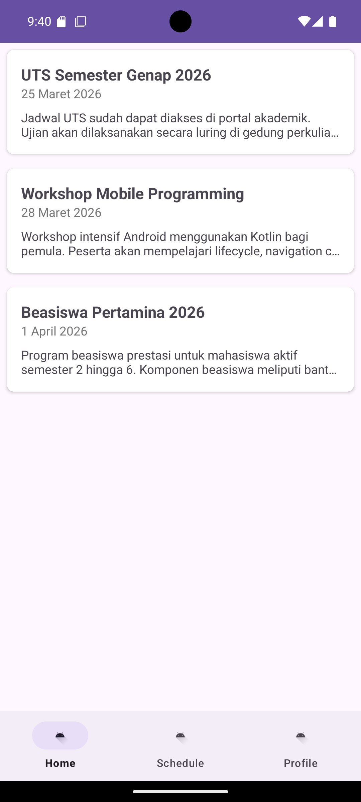
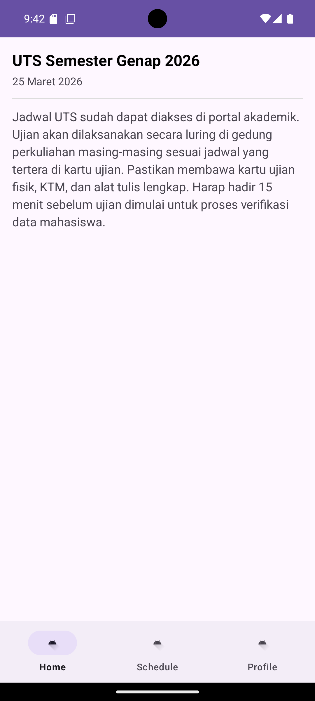
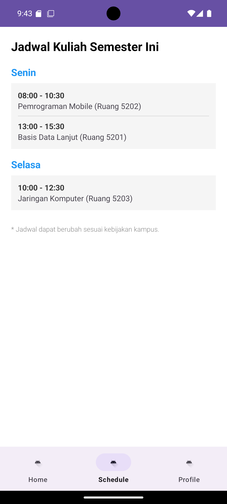
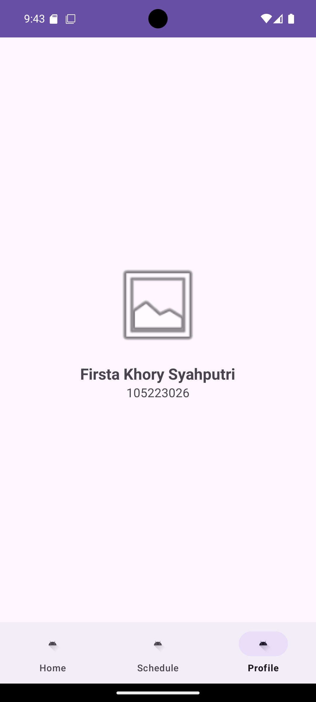

# CampusInfo App - Tugas Hari Raya PPB

**Nama:** Firsta Khory Syahputri  
**NIM:** 105223026

## Deskripsi
Aplikasi informasi kampus Universitas Pertamina yang menampilkan pengumuman terbaru, jadwal kuliah harian, dan profil mahasiswa. Aplikasi ini dibangun menggunakan Android Studio dengan bahasa Kotlin dan menerapkan Navigation Component serta View Binding.

## Fitur Utama
* **Beranda:** Menampilkan daftar pengumuman kampus yang bisa diklik untuk melihat detail lengkap.
* **Jadwal:** Menampilkan jadwal kuliah mingguan yang terstruktur.
* **Profil:** Menampilkan informasi biodata mahasiswa.

## Screenshot
Berikut adalah tampilan antarmuka aplikasi:

### 1. Beranda (Home1)

### 2. Beranda (Home2)

### 3. Jadwal Kuliah (Schedule)

### 4. Profil Mahasiswa (Profile)
